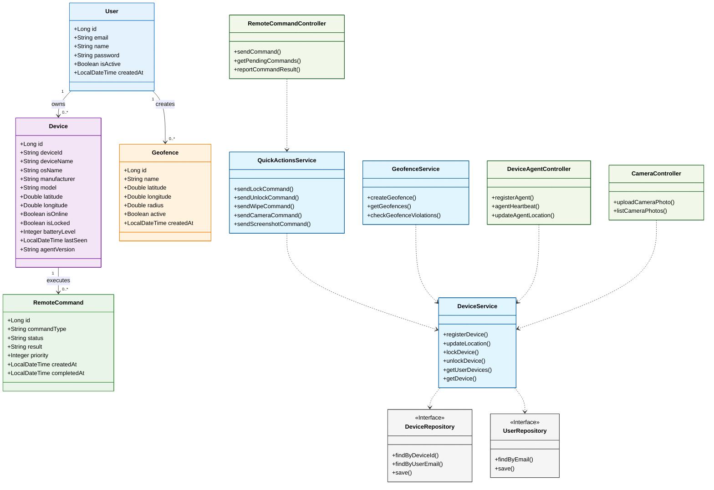

# LAPSO System Class Diagram

```mermaid
classDiagram
    %% Core Domain Entities
    class User {
        +Long id
        +String email
        +String name
        +String password
        +Boolean isActive
        +LocalDateTime createdAt
    }
    
    class Device {
        +Long id
        +String deviceId
        +String deviceName
        +String osName
        +String manufacturer
        +String model
        +Double latitude
        +Double longitude
        +Boolean isOnline
        +Boolean isLocked
        +Integer batteryLevel
        +LocalDateTime lastSeen
        +String agentVersion
    }
    
    class RemoteCommand {
        +Long id
        +String commandType
        +String status
        +String result
        +Integer priority
        +LocalDateTime createdAt
        +LocalDateTime completedAt
    }
    
    class Geofence {
        +Long id
        +String name
        +Double latitude
        +Double longitude
        +Double radius
        +Boolean active
        +LocalDateTime createdAt
    }
    
    %% Key Service Classes
    class DeviceService {
        +registerDevice()
        +updateLocation()
        +lockDevice()
        +unlockDevice()
        +getUserDevices()
        +getDevice()
    }
    
    class QuickActionsService {
        +sendLockCommand()
        +sendUnlockCommand()
        +sendWipeCommand()
        +sendCameraCommand()
        +sendScreenshotCommand()
    }
    
    class GeofenceService {
        +createGeofence()
        +getGeofences()
        +checkGeofenceViolations()
    }
    
    %% Key Controller Classes
    class DeviceAgentController {
        +registerAgent()
        +agentHeartbeat()
        +updateAgentLocation()
    }
    
    class RemoteCommandController {
        +sendCommand()
        +getPendingCommands()
        +reportCommandResult()
    }
    
    class CameraController {
        +uploadCameraPhoto()
        +listCameraPhotos()
    }
    
    %% Repository Interfaces
    class UserRepository {
        <<Interface>>
        +findByEmail()
        +save()
    }
    
    class DeviceRepository {
        <<Interface>>
        +findByDeviceId()
        +findByUserEmail()
        +save()
    }
    
    %% Relationships
    User "1" --> "0..*" Device : owns
    Device "1" --> "0..*" RemoteCommand : executes
    User "1" --> "0..*" Geofence : creates
    
    %% Service Dependencies
    DeviceService ..> DeviceRepository
    DeviceService ..> UserRepository
    QuickActionsService ..> DeviceService
    GeofenceService ..> DeviceService
    
    %% Controller Dependencies
    DeviceAgentController ..> DeviceService
    RemoteCommandController ..> QuickActionsService
    CameraController ..> DeviceService
    
    %% Style
    style User fill:#E3F2FD,stroke:#1976D2,color:#000
    style Device fill:#F3E5F5,stroke:#7B1FA2,color:#000
    style RemoteCommand fill:#E8F5E8,stroke:#388E3C,color:#000
    style Geofence fill:#FFF3E0,stroke:#F57C00,color:#000
    
    style DeviceService fill:#E1F5FE,stroke:#01579B,color:#000
    style QuickActionsService fill:#E1F5FE,stroke:#01579B,color:#000
    style GeofenceService fill:#E1F5FE,stroke:#01579B,color:#000
    
    style DeviceAgentController fill:#F1F8E9,stroke:#1B5E20,color:#000
    style RemoteCommandController fill:#F1F8E9,stroke:#1B5E20,color:#000
    style CameraController fill:#F1F8E9,stroke:#1B5E20,color:#000
    
    style UserRepository fill:#F5F5F5,stroke:#424242,color:#000
    style DeviceRepository fill:#F5F5F5,stroke:#424242,color:#000
```