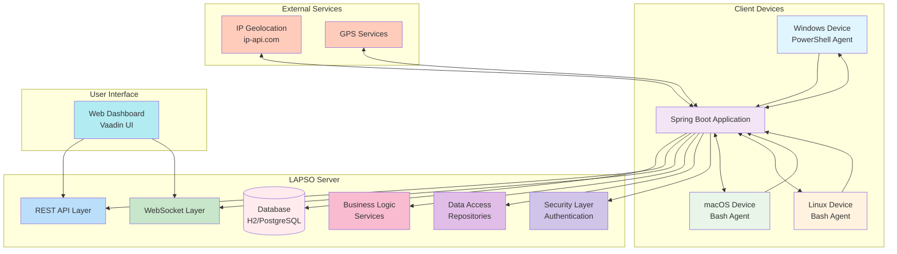

# LAPSO System Architecture

## Component Descriptions

### Client Devices
- **Windows Device**: Runs PowerShell agent that sends heartbeats and executes commands
- **macOS Device**: Runs Bash agent for device tracking and remote actions
- **Linux Device**: Runs Bash agent for cross-platform compatibility

### LAPSO Server (Spring Boot Application)
- **REST API Layer**: Handles HTTP requests from agents and dashboard
- **WebSocket Layer**: Provides real-time updates to the web dashboard
- **Business Logic**: Services implementing core functionality (tracking, commands, geofencing)
- **Data Access**: Repositories for database operations
- **Security Layer**: Authentication and authorization mechanisms

### Database
- **Development**: H2 in-memory database
- **Production**: PostgreSQL database with geospatial extensions
- Stores device information, user data, commands, and tracking history

### User Interface
- **Web Dashboard**: Vaadin-based UI for device management and monitoring
- Real-time map view with device locations
- Command interface for remote actions (lock, alarm, wipe)

### External Services
- **IP Geolocation**: Provides location data when GPS is unavailable
- **GPS Services**: High-accuracy location data when available

## Data Flow

1. **Device Registration**: Agents send initial registration with device information
2. **Heartbeat Communication**: Agents send periodic heartbeats with location data
3. **Command Processing**: Server sends remote commands to devices (lock, alarm, etc.)
4. **Real-time Updates**: WebSocket pushes device updates to dashboard
5. **Data Storage**: All information is persisted in the database
6. **User Interaction**: Administrators interact with the dashboard for device management